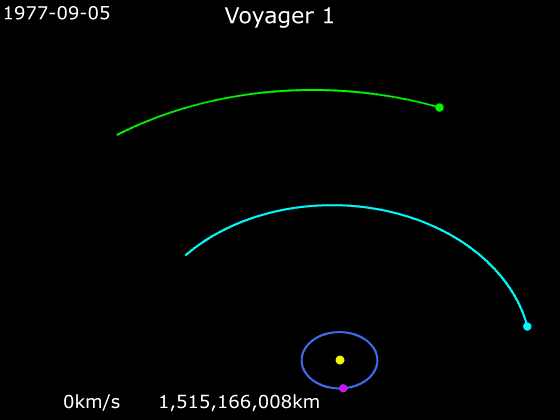
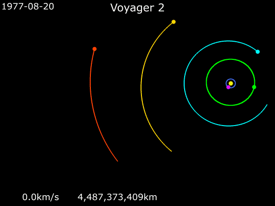
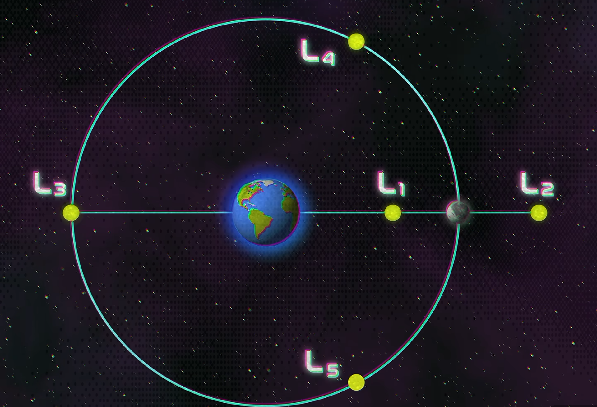
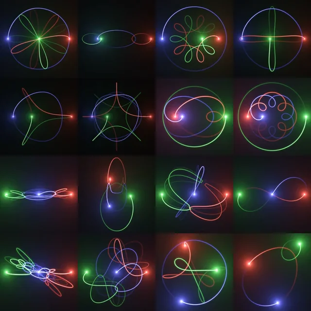

# GravityResearch
An accurate atrophysics simulation of gravitational interactions between stellar objects: Gravity Assists, Lagrange Points, Three-Body-Problem. 

# The classis Three-Body problem is unsolvable; it is mathematically chaotic.
This is unless we make certain assumptions about the system that we would invoke so we CAN solve it:
1.	A small third object with negligible mass around bigger 2 with similar masses
2.	Restrict initial positions/shape so that with every iteration the system stays self-similar
3.	Like the first one, the 2 big objects orbit their common centre of mass in a perfect circle (not ellipse) which makes the Lagrange points fixed/predictable
4.	Planar restriction – assume all motion happens in a single plane by ignoring inclination/out-of-plane motion
5.	Tight pair (two bodies close together, orbiting each other) plus a third one very far away which exerts a small perturbation. Splits the problem into two separate two-body problems.
6.	One gravitational pull dominates and the others are small corrections.

Combining number 1, 3, 4 makes the Planar Circular Restricted Three-Body Problem (PCR3BP). This is what gives us clean 5 Lagrange points.
______________________________________________________________

A look into Gravity Assists:

What are Lagrange Points

The Three-Body-Problem

